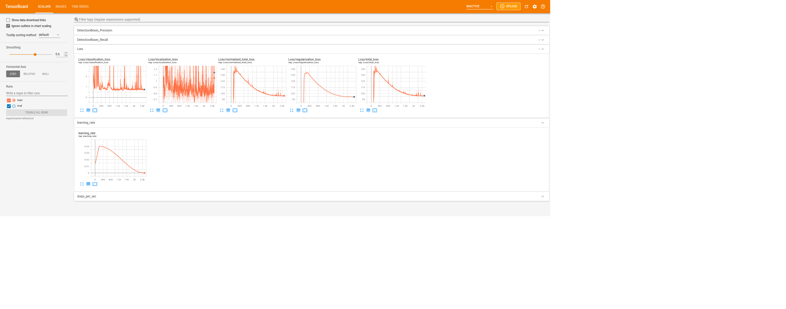
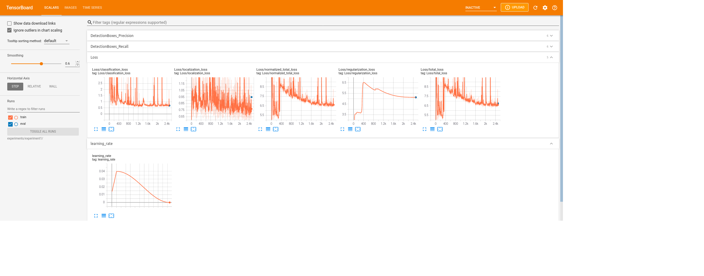
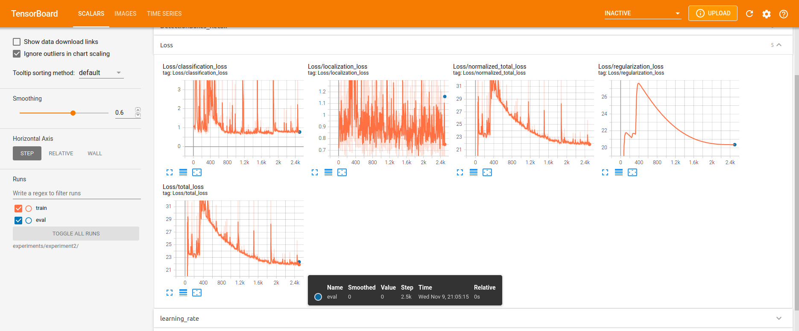
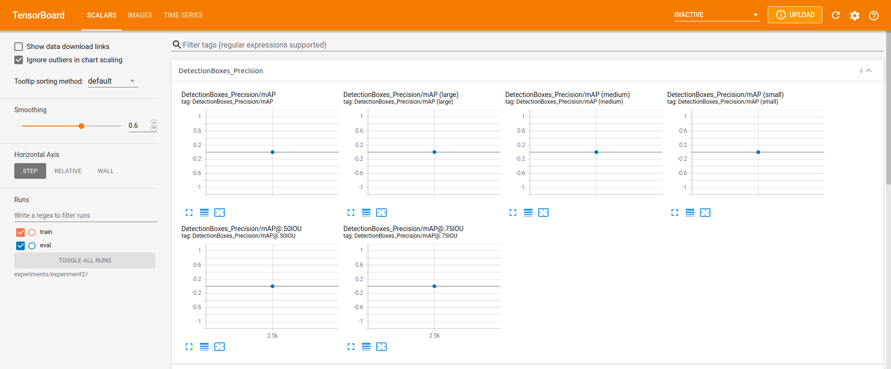

# Project 1: Object Detection in an Urban Environment

## Project Overview

In this project I attempted to train a neural network to detect vehicles, pedestrians and bicyclists in camera images. Detecting such objects is important for a self driving car because these are common objects encountered on the road, with which collisions must be avoided. And, unlike many other objects, these are likely to move.

## Setup

I worked in the provided workspace, so no setup was needed aside from modification of the included files. The included requirements.txt is the output of pip freeze in the workspace. 

## Dataset

The dataset consisted of frames from a car mounted camera. They were taken in a variety of weather and lighting conditions. The data also included labels of cars, pedestrians and bicyclists, with cars being most common, and bicyclists rarest. 

Example images with ground truth boxes are shown in 'Exploratory Data Analysis.ipynb'.

For cross validation, I simply used the provided splits in the workspace, with 86 tfrecord files for training and 10 for validation.

## Training 

### Reference Experiment

Running with the provided configuration performed poorly. As shown in the below images, loss was very large and dominated by regularization loss, and MaP and recall were both near zero.

### Improve On the Reference

#### First Experiment

I initially tried adding the random_black_patches and random_rgb_to_gray augmentations, but ended up removing the black patches. As shown in the following graphs, loss improved significantly but MaP and recall were still near zero.

#### Second Experiment
In a second experiment added the augmentations random_adjust_saturation, data_augmentation_options, random_adjust_brightness, and random_distort_color to the one used in the first experiment. A sampling of images with these augmentations is shown in 'Explore augmentations.ipynb.' But in this case loss got worse, while still being better than the reference case, and MaP and recall remained near zero. 

